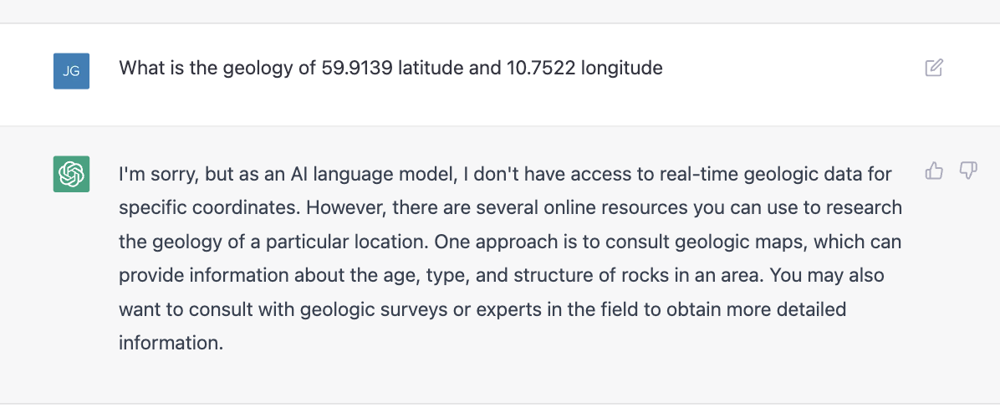
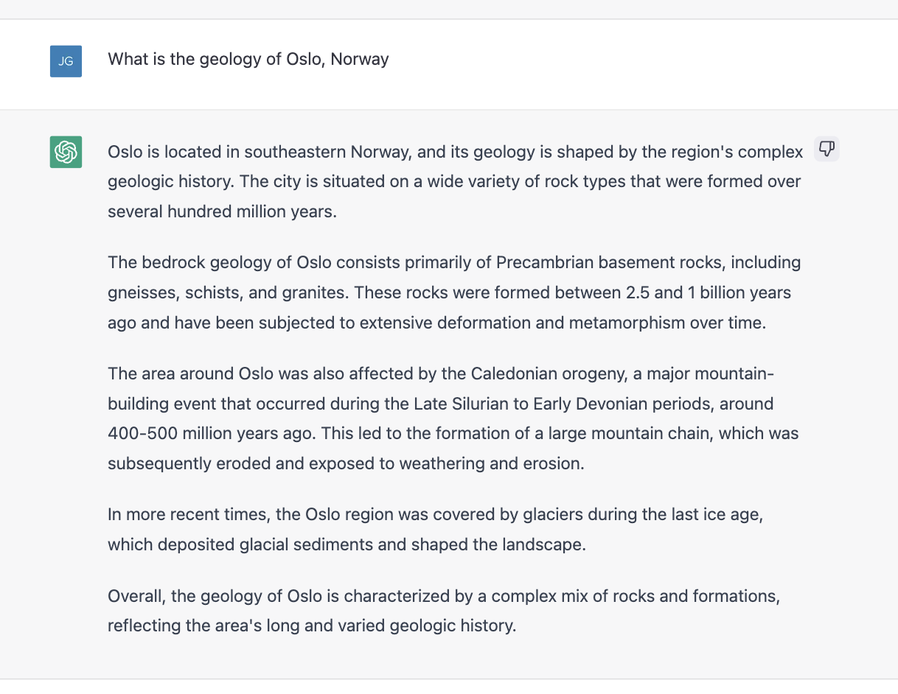
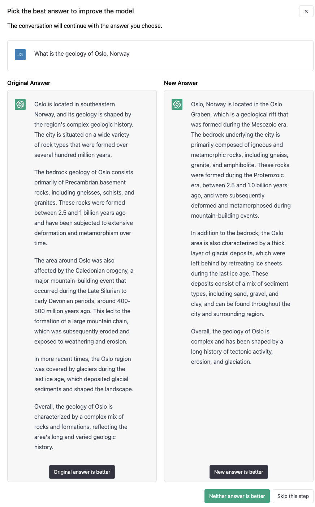

# On Large Language Models and Roadside Bot Geologists

## Summary

Although geology education is largely classroom-based, geology field trips are a common shared experiece that 
makes up an important part of geology education. The experience of standing beside a cliff face while someone 
expertly points out the subtle details of the rock formations, contextualizing them within the broader regional 
geology, and using them as examples to illustrate fundamental geological concepts is a quintessential part of 
geology education. In fact, there exists an entire genre of books called "roadside geology of ____" that 
capitalize on the idea of using point locations along a route to build a larger understanding of geological 
phenomena. The information in these books is often presented in a manner that mirrors the traditional field 
trip experience.

Usually, someone with deep knowledge of the area is needed to lead these excursions, 
as they are familiar with the stops along the way and have spent countless hours researching and organizing 
the information to be delivered at each stop. This includes accounting for the audience's level of knowledge 
and the time available to deliver the content. However, there are times when such a knowledgeable guide 
is not available. Perhaps a geologist, or simply someone with an interest in geology, is driving along a road 
or looking at a map and wishes they had access to information about the local geology and its broader context. 

> Is it possible to create a bot that can take on at least some of the role of a field trip leader, by 
finding and presenting relevant geological information to those who seek it?

As technology continues to improve, with advancements in machine learning and natural language processing, 
it becomes increasingly plausible to automate information delivery in this way. 
This document poses the question of whether we are approaching the day when an AI geology professor can 
at least provide an introductury statement that might be delivered at the beginning of a field trip stop. 

> This document explores the ways in which large language models make it easier to accomplish certain tasks that were 
once impossible to do programmatically, while also highlighting the challenges that remain.

## The context of when was this written

This was written in March of 2023. There has been a surge of interest and activity in large language models 
driven by the capabilities of OpenAI's ChatGPT application and foundational models

While I've previously done some work and side projects in more traditional natural language processing areas, 
this is my first experiment using pre-built large language models in a side project. Needless to say, I have 
no idea what I'm doing. There's a high chance I'll look back on this writing in 3-12 months and groan, but for now it is helping me collect my thoughts.

 [RIP Bailey the "I have no idea what I'm doing" dog](https://www.reddit.com/r/pics/comments/7oym1s/reddit_you_made_our_dog_semifamous_years_ago_you/)

## The user experiences I aim to build

To user experience I am trying to build is: 
1. The user inputs a latitude and longitude. 
  - This could be via text input form, it could be through you giving your phone's browswer permission to access your location, or it could be through inputting a city, state, and country name that is then geocoded to a point. In all cases, it is a point location.
2. The user is told a narrative about the geology at that point. 
  - Initially, the idea is the information involved is: 
    - Geology at the surface at that point.
    - Regional context of that local geology. 

This mirrors in many ways the "real-world" geology field trip experience. Someone tells you about the rocks in front of 
you and then puts them into context.

### Prior art with Macrostrat API and text-to-speech in a simple webpage

I've previously experimented with this sort of idea in an Observable notebook called *["Stratigraphy Speech"](https://observablehq.com/@justingosses/stratigraphy-speech)* that was created shortly before a multi-state road trip. 

> I wanted to have something an automated "road-side geology of ___" book that I could turn on from my phone while driving.

This approach uses no large language model or any other type of natural language processing. It calls a singular API 
with a point location and parses the data it gets in response.

An observable notebook is a website that holds the code and executes it at the same time. The webpage asks for the user's 
location via the location API built into every browswer & permission to play sound. Once it has those, it uses the location to call the [Macrostrat API](https://macrostrat.org/), which returns data in a JSON that describes the top two geologic units at that location. This JSON file is parsed by several different JavaScript functions 
that you can see in the notebook and the resulting inforation is combined with pre-written text into a standard one-size 
fits all narrative. That narrative is then spoken to the user via browser's text-to-speech capabilities, which all 
browsers now have but are rarely used.

The end effect is a webpage you can give permissions for in advance and then open later. Upon pushing one 
button, it will tell you about the geologic unit at the surface at that location.

#### Limitations of this approach

Upon using this, there are a few limitations that quickly become obvious. First, due to the narrative being one-size fits 
all and deterministically created from well structured data, it can get kind of boring to hear again and again as you 
drive down the road. Even if the 
units age and lithology vary, all of the glue words stay the same every single time you try to get information. Second, 
there is not regional information of contextual information. All you get is what the API gives you, which is lithology, age, and maybe interpreted depositional environment, all data originally extracted from a geologic map.


## The problem of trying to scale creating geological narratives from data APIs.
Ideally, you'd be able to not just get an individual point location data read back to you in a single construction. 
You would also get regional geology, historical narrative, information on what is unique, etc. The content you want as 
narrative could reasonably vary, just like actual field trips. There are a variety of other variations in what information 
is provided, how it is provided, and how the user interacts with it that quickly start to pile up if you want to make 
something useful and pleasant to use.

Types of variations in the information that might be desired:
- Short summary vs long with details
- Point-based information vs. regional-based information
- General information vs. sub-field specific
- For general audience vs. for expert audience

Types of interactions with information
- one-way or chat
- statement vs. question & answer
- text or speech

To do all this with deterministic traditional programming becomes both complex and tedious rather quickly. 
Well structured standarized sources of information must be located, assuming they exist. Often times, they don't exist. 
Where they do exist, many different functions must be written for each new piece of well-structured information and 
each new way to present that information. 

> Using traditional deterministical coding to programmatically create narratives from data APIs becomes too laborious quickly unless all the information needed is already very well structured in a finite number of known places and the 
number of ways people want to interact and hear about that information is limited.

## What Large Language Models Offer
Large language models (LLM) offer an improvement on this experience. Their outstanding ability to predict reasonable sounding 
next words given a prompt enables them to do a variety of tasks directed by plain instructions, also known as "prompts".

Because they are good at predicting the next words given a sequence, they can do the following tasks:

### Skilled summarization
LLM can summarize three pages of text into a single paragraph. They can also summarize text with a focus on specific 
types of content or in a specific style of writing or speaking.

### Flexible extraction 
LLM can extract keywords, concepts, and specific information from text. When my previous team at NASA created a model to predict topic tags against abstracts and READMEs, it required a pre-existing dataset of millions of labeled abstracts 
and months of training and evaluating different models. Now you can get comparable performance from an OpenAI model without 
having to do any of the data preparation or training yourself. Additionally, you can just provide a list of possible 
tags in the prompt, or none at all, and it returns useful predictions. It is serious jump in capabilities compared to 
what existing one or two years ago. 

### General knowledge....to some extent
Althogh LLMs are infamous for making up things that sound right, they can also return general knowledge accurately at 
times. Figuring out when to trust such information evolves a lot of trial and error before you can be confident of 
accuracy for a given request. 

As an example, if you just ask ChatGPT to "Describe the geology of [insert a city]", the answer it gives varies in accuracy. For Port Clinton, Ohio, it tends to be do well, perhaps becaues the only writing that involves both "Geology" and "Port Clinton, Ohio" is about the geology of Port Clinton. In constrast, the same question for Houston, Texas gets 
some information wrong. The formation ages given are common formations to be discussed where the world "Houston" is used 
but not actually the top two formations.

As supurb prediction machines LLMs can give inaccurate information when the most common text that shares the words in the 
prompt isn't exactly what the prompt is asking. Other times, it seems there likely isn't anything in its training that relates to the question in prompt.

> To get around these knowledge limitations, we can combine LLMs with geologic data APIs and easily searchable text 
on the subjects requested in the prompt. We can also use cleaning and validation functions to figure out what information 
might be more trustworthy or relate the most to the given question.

## Large Language Model Techniques
By combinging determnistitic APIs, LLMs API calls with different prompts, and various validation and data cleaning 
functions we can create "chains" that get around some of the limitations of using just deterministic approaches or 
just LLM approaches. 

For more about "agents", "chains", and other concepts, check out the documentation for [Lanchain](https://python.langchain.com/en/latest/) or [Semantic-Kernal](https://devblogs.microsoft.com/semantic-kernel/), two libraries for calling OpenAI-type model APIs.

## How does ChatGPT do with single questions:

If asked to "Describe the geology of [insert point coordinate]", it 
defers as the task is not something it is comfortable doing.



If I instead ask it to describe the geology of a well known location, 
it complies but does so in a way that is not entirely correct. 
Although there is precambrian bedrock in the area, a geologic map 
of the area (which you can find [in this research paper](https://www.researchgate.net/profile/Mark-Smethurst/publication/301546802/figure/fig3/AS:359759359299591@1462784723827/Bedrock-geology-map-of-the-Oslo-area-featuring-the-NNE-SSW-Oslo-Rift-with-its-associated.png) or on [Macrostrat](https://macrostrat.org/map/loc/9.9939/59.9634#x=9.754&y=59.995&z=6.7) ) shows there is more recent glacial deposits on top in addition to much older metamorphized 
sediments.



Interestingly, if you use the thumbs down button to let ChatGPT know 
it is incorrect, it asks how it is incorrect. It then uses that information to suggest an improvement as shown below on the right side.


 
> Ideally, however, we can get a programmatic answer that is entirely correct. 

One way to possibly do that is to source factual data and then have a LLM model reorganize that information into text that matches your needs.

## Where to get data 

Currently, I am working with two places to source geologic information.

### Bing Geocoding API:

Given that the process I am developing starts with a point location but the information I want to 
provide include regional context, I need the words to find the appropriate regional names. To get 
them I use the Bing Maps Geocoding API. Under a certain amount of calls, the geocoding service is free. 
I provide a latitude and longitude, it returns a street address, including state and country.

### MacroStrat: Well-structured information about a point location

Macrostrat describes itself at "the world's largest homogenized geologic map database". You can find a longer description on their 
[website](https://macrostrat.org/). We use their API to source 
geologic data for a point location. One endpoints of their API provides both stratigraphic column information across most of United States of America and Canada. Another endpoint grabs the bedrock geology from large regional and global maps. Where the stratigraphic 
information exists, that is preferred due to higher resolution information. In addition, it lets you 
ignore the boring "recent alluvil soil" that sometimes covers the most interesting bedrock geology 
underneath. 

Although Macrostrat is great as a single API that gets you point location information around the world, 
it is limited in that it doesn't provide any regional information or geologic history. It just says 
what types of rock exist at a given point. For that broader type of regional, causual, or 
historical information, we need to look elsewhere.

### Wikipedia: Semi-structured sources of regional information

One place to get regional geologic information is wikipedia. There are variety of [python packages](https://github.com/goldsmith/Wikipedia) 
built to call the Wikipedia API. We can use them to search for "Regional geology of [insert location]", 
get back pages, evaluate the pages by some criteria, and then have a LLM summarize the regional geology 
into a paragraph instead of however long the Wikipedia page is. 

This approach often works out great as there are many wikipedia pages written about the geology of 
states, proviences, and countries. For example, [this is a wikipedia page about the Geology of Ohio](https://en.wikipedia.org/wiki/Geology_of_Ohio). It is the first Wikipedia search result for 'Geology of Ohio'.

However, other times the page returned does not describe the geology of the location we're interested in. For example, a search for 
[Geology of Oslo](https://en.wikipedia.org/wiki/Special:Search?go=Go&search=Geology+of+Oslo&ns0=1) returns back several pages, but 
nothing that is exactly geology of Oslo Norway. Pages that return are "University of Oslo", "Geology", 
"Natural History Museum at the University of Oslo", "Oslo Graben", and "Geology of Great Britain".

What is needed to get around this behavior is (1) a method to evaluate the validatity of the search result for our task (2) and a fallback strategy for what to do next. 

### Other unstructured sources of geology information: bing search, literature, etc. 

Other sources of information might be literature or search engine results. 
I am not currently doing this, 
but opportunities exist. For example, the Macrostrat map API often provides a way to grab 
literature references associated with the map. 

## Combining 


### Chaining rule-based functions vs. prompt-based functions


#### Chains, Agents

You can learn more about chains and agents....... INPUT


## Current experiments on part of a weekend

Resuls for  "latitude": 41.512, "longitude": -82.9377:

```


        "fullAddress": "230 E 2nd St, Port Clinton, Ohio 43452, United States",
        
        "geology_response": "\n    The top two layers at this location are separated by a gap of millions of years. The top layer is 0.0117 million years old and is composed of gravel, sand, and clay in proportions of 48.81%, 44.05%, and 7.14%, respectively. The depositional environment of this layer is glacial and lacustrine in proportions of 66.67% and 33.33%, respectively. The second layer is 358.9 million years old and is composed of shale, sandstone, limestone, and dolomite in proportions of 37.5%, 12.5%, 31.25%, and 18.75%, respectively. The depositional environment of this layer is marine and inferred marine in proportions of 6.25% and 93.75%, respectively.",
        
        "regional_geology_subarea": "regional geologic history",
        
        "regional_tectonic_geology_response": "\nOhio's geologic history dates back to the Precambrian eon, 
        when the Grenville Province and Superior Province formed the crystalline basement rock. Subsequent mountain building events such as the Taconic orogeny and Acadian orogeny led to sediment deposition in the Paleozoic Era (539-251 million years ago). This sedimentary rock from the Devonian, Mississippian, Pennsylvanian, and Permian periods has been found, along with some bones and plant fossils from the Pleistocene. Unfortunately, the Pleistocene glaciations erased much of the geologic history, leaving little trace in the Mesozoic and Cenozoic. \n\nOhio's geologic history is quite ancient, stretching back to the Precambrian eon. The Grenville Province and Superior Province formed the crystalline basement rock, and subsequent mountain building events such as the Taconic orogeny and Acadian orogeny led to sediment deposition in the Paleozoic Era. This sedimentary rock from the Devonian, Mississippian, Pennsylvanian, and Permian periods has been found, along with some bones and plant fossils from the Pleistocene. \n\nUnfortunately, the Pleistocene glaciations",
```

Resuls for latitude = 40.7128 longitude = -74.006 

```
    {
        "fullAddress": "39 Park Row, New York, New York 10007, United States",

        "geology_response": "\n    The top two layers at this location are separated by a gap of 0.3761 million years. The top layer is 0.0117 million years old and is composed of 100% sand with a predicted depositional environment of 50% shoreface and 50% fluvial indeterminate. The second layer is 0.4398 million years old and is composed of 14.29% gravel and 85.72% sand with a predicted depositional environment of 33.33% estuary/bay, 33.33% outwash plain, and 33.33% lacustrine indeterminate. This layer also has an economic value of sand and gravel for construction material.",

        "regional_geology_subarea": "regional geologic history",
        
        "regional_tectonic_geology_response": "\nNew York's geology is composed of ancient Precambrian crystalline basement rock, sedimentary rocks from the Paleozoic, and fossil-bearing volcanic and sedimentary rocks from the Mesozoic. The Hudson Highlands and Manhattan Prong were deformed and metamorphosed by the Avalonian mountain building event 575 million years ago. During the Paleozoic, New York experienced a marine transgression and the Taconic and Acadian orogenies. The Newark Basin formed during the late Triassic. Rivers were rechanneled or filled with sediment during the Pleistocene glaciations.\n\nNew York's regional geologic history is a long and complex one. It began with the formation of ancient Precambrian crystalline basement rock and sedimentary rocks from the Paleozoic. The Avalonian mountain building event 575 million years ago caused the Hudson Highlands and Manhattan Prong to be deformed and metamorphosed. During the Paleozoic, New York experienced a marine transgression and the Taconic and Acadian orogenies. The Newark Basin formed during the late Triassic. The Pleistocene glaciations caused rivers to be rechanneled or filled with sediment. Cenozoic rocks are rare in New York, but present offshore",
        "date": "2023-03-27 00:27:13"
    }
```


### Learnings from current experiments

My experience building the previous experiment leveraging the MacroStrat API in a quick Observable Notebook was 
that it worked, but the experience was lacking. The content was limited to only a point location and tended to become 
boring after while. It also led to wanting more context beyond that point. Writing code to create more variable 
narratives was obviously possible, but the time to do so not minor.

> The OpenAI API's ability to reword the data into narratives helps the information be less boring. Additionally, 
its ability to rephrase and summarize the content opens up the opportunity to use additional information that is not
structured data from an API but unstructrued data from various sources.

Technically speaking, this was also possible with other methods, but the amount of time it would take to build is 
substantial for each new feature add. In contrast, getting to the same experience by combinging data APIs, search 
results, etc. with LLM prompts feels much easier. 

> The slope of labor for functionality is much lower if LLMs are used.

##### How Big a Change in Productivity
The thing it feels most similar to out my my own experiencesw is the appearance of NASA Worldwind / Google Earth.
When I started graduate school in 2004, I needed aerial imagery of the area I was going to do field work at later 
that year. The process at the time involved looking at squares on a map, sending an email to purchase images of that 
square over several days, and then waiting two weeks for the physical to arrive. You would hope the days you purchased 
did not have clouds. After I did that once, NASA Worldwind and shortly after Google Earth came out. Instead of 
waiting two weeks, you could scroll everywhere on the planet and instantly see satellite images of all the locations.
It was a big enough change that the entire research group was behind a computer calling out new locations to scroll to next.

## What is still hard

What now controls the productivity curve for programmatic descriptions of geology at point X how it fits in the regional 
context, are two related constraints. 

First, can you figure out if the result is reliable enough to use. A prompt can 
work fine two or ten times before giving an unexpected result on the eleventh. To some extent both prompts and deterministic 
functions can be used to validate responses. The number of geology terms in a Wikipedia page can help provide a clue to 
whether that page is a valid result to summarize for the regional geology. However, the wikipedia page for "geology" 
has a lot of geology terms even though it is not at all what's wanted for the geology of the region around Oslo, Norway. 
Prompts combined with traditional natural language processing is probably more effective, but creating effective methods 
requires creativity, and at least initially, a well-informed human looking at the results.

Second, are there enough data APIs and sources of unstructured factual information with the right information for 
your task? Some states are too small to have a wikipedia page titled "Geology of [insert state]". Other times the 
state or country boundaries are much less useful than other boundary terminology. What appears to have potential is 
a combination of functional and prompt-based data requests, validation, rankings, cleaning, and resummarization.

## What might be in near-future

....... agents ........


...... tests .......


....... different prompt styles ......

### Other directions to go besides the give me geology for this point application

outcrop finder...

chat....


research paper finder that's insanely more useful..

Danger areas.... search terms that overlap with different content.. need to be specific.


User needs time, patients, knowledge, and skill with pure ChatGPT or similar.


#### Reminder

I have no idea what I am doing. I do not speak for my employer here.